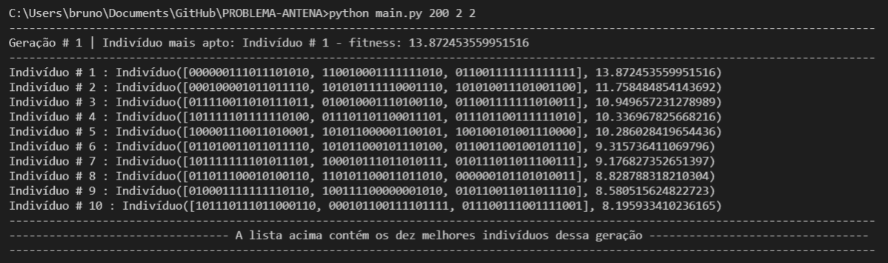
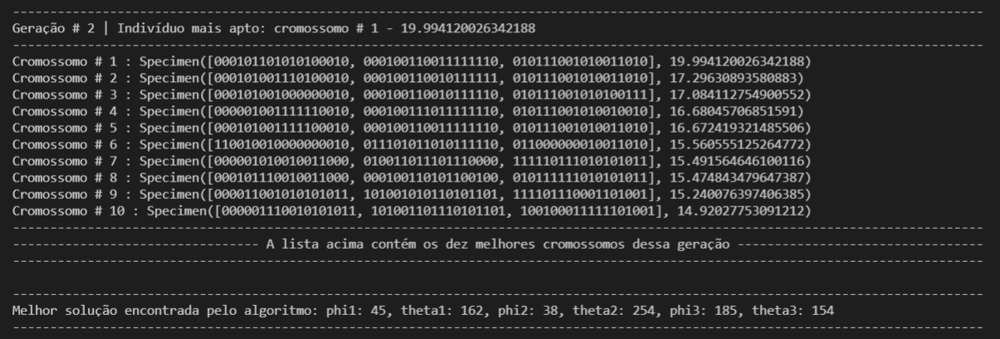

<h1 align="center">
  OTIMIZAÇÃO DE ANTENA PARA PADRÃO DE RADIAÇÃO
</h1>

<h3 align="center"><a href="https://github.com/aydanomachado/mlclass/tree/master/02_Optimization">Atividade 02 - Otimização de antena para padrão de radiação</a></h3>

<h4 align="center">Utilize o link acima para baixar o arquivo "OPServer.jar"</h4>

## ❓ Como utilizar?

### Inicialização do servidor - OPServer.jar
#### * O servidor é necessário para o funcionamento correto * 
```bash
$ java -jar OPServer.jar
```

### Utilizando a aplicação
#### * Os campos entre parênteses são entradas para valores inteiros *

```bash
$ cd PROBLEMA-ANTENA
$ python main.py (população máxima) (quantidade de gerações) (porcentagem de mutação)
```

## 💻 Exemplo de uma execução

<h1 align="center">
  
</h1>

<h1 align="center">
  
</h1>

<p align="center">
  Criado por Bruno Lemos.
</p>
